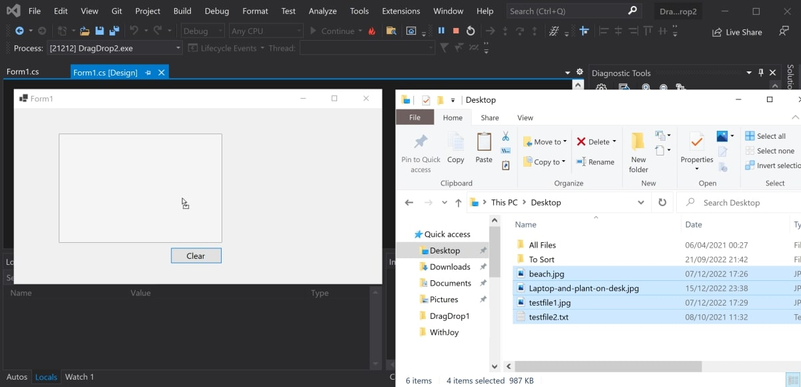

# Winforms-Drag-Drop-App
A simple application that includes drag and drop functionality.

## Prerequisites 

* Make sure you have Visual Studio installed.

## To Run

* Navigate to the DragAndDropApp folder.
* Click on DragAndDropApp.sln to open the solution.
* Press the green play button at the top of the Visual Studio window.
* Code for drag and drop functionality is in Form1.cs.

## Example

